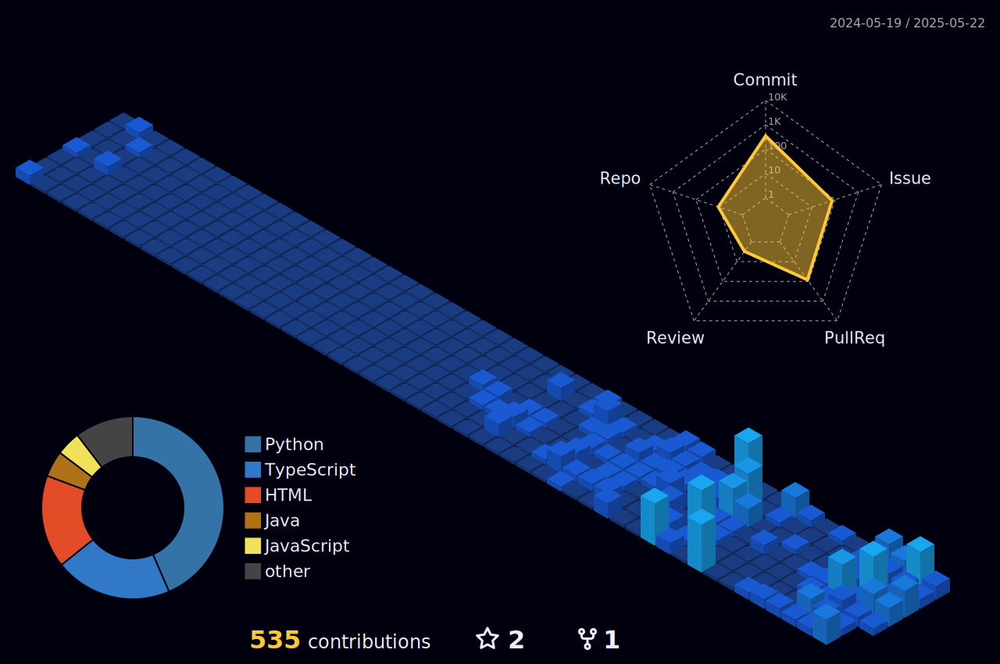

### Hi there 👋

Skills: REACT / Redux / TS / JS / HTML / CSS / Node / Express / MongoDB / Material UI

- 🔭  I’m currently working on ReactJS. 
- 🌱  I’m currently learning MERN Stack. 
- 🤔  I’m looking for help with Test Case Writing. 
- 💬  Ask me about ReactJS.

 

